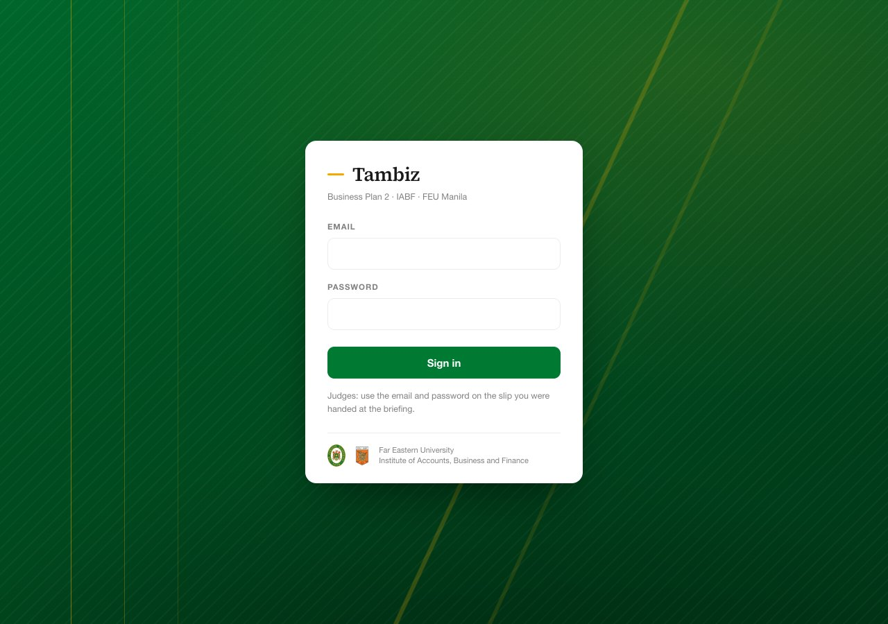

# Tambiz

Judging, results and grades for the annual Tambiz awarding at FEU Manila, where MGT1114 Business Plan 2 groups defend their business plans and run a booth before a panel of judges.



## What it does

- **One workbook in.** The coordinator's staff fill in one Excel file, students with their group and adviser on one sheet and the judges on another, and upload it. Mistakes are named row by row, and uploading again never adds anyone twice.
- **Judges score on their own phones.** Each judge signs in, picks a group, and scores one category at a time with the criterion's wording and maximum beside every box. A score over the maximum is refused, not quietly changed, and scores typed with no signal are kept on the phone and sent later.
- **The coordinator sees the evening as it happens:** which groups each judge has finished, and which scores do not count yet because a judge has not submitted them. A mistyped score can be corrected, with a reason, and the judge's own score is kept beside it.
- **Results and grades follow the department's rules exactly.** Category and overall rankings, the top 10 for the awarding, and every student's grade from the FEU letter bands. A blank is never counted as zero, and every number has two decimals, on screen and in Excel alike.
- **Judge profiles** show how each judge marks compared with their co-judges, as a basis for knowing the panel, not for judging the judges.
- **Two files out.** Closing the event gives the department's Excel workbook, with the official grade sheet ready to encode, and an email file that Microsoft Power Automate sends from the coordinator's mailbox: each student their letter grade and group percentage, each adviser their groups' results, and never a rank.

The coordinator's manual, with a picture of every step, is in [`docs/manual/`](docs/manual/): [`Tambiz-Manual.pdf`](docs/manual/Tambiz-Manual.pdf).

The original single-file calculator the app replaced is kept as [`index.html`](index.html). It still opens in any browser, and it is the authority the app's scoring is tested against.

## Run it on your computer

It needs **Node.js 22 or newer**, and either a **Postgres connection string** or nothing at all: without one, the app uses PGlite, a real Postgres compiled to WebAssembly, stored in `.local-db/`.

```bash
npm install
DATABASE_URL= npm run dev
```

Open http://localhost:3000. The empty `DATABASE_URL=` makes sure a connection string in a local `.env.local` file is not used. The first start fills the local database with a practice event of invented students, groups and scores. Delete `.local-db/` to start again.

The sample sign-ins use the password `tambiz-demo-2027`, or `SEED_ADMIN_PASSWORD` and `SEED_JUDGE_PASSWORD` when those are set:

| Role | Email |
|---|---|
| Coordinator | `admin@tambiz.demo` |
| Judge | `judge1@tambiz.demo`, `judge2@tambiz.demo`, `judge3@tambiz.demo` |

To use your own Postgres instead, set `DATABASE_URL` to its connection string.

### Tests

```bash
npm test
```

- `tests/golden.test.ts`: the reference answers from the original `index.html`; where the department changed a rule, the test names the old answer and the decision.
- `tests/crosscheck.test.ts`: runs the scoring functions extracted from `index.html` on random events and checks the app gives the same percentages and ranks wherever nothing is blank.
- `tests/upload.test.ts`: the workbook in, and above all that uploading never touches a score and never removes anybody.
- `tests/app-flows.test.ts`: the coordinator's flows on a real Postgres in memory: tables, absence, corrections, closing, undoing, and the email file.
- The rest cover closing, rankings, the emails, judge profiles, the criterion wording, workbook rounding, the table and the schema.

## How it is deployed

The live app runs on two free plans: **[Vercel](https://vercel.com)** (Hobby) for the site and **[Neon](https://neon.com)** (Free) for the Postgres database, both in Singapore so every click stays close to Manila. A change merged into `main` goes live by itself in about a minute. There is no other paid service: the emails go out from the coordinator's own mailbox.

To set it up from nothing:

1. **Create the database.** In Neon, create a project in the Singapore region (AWS ap-southeast-1) and copy its connection string (it starts `postgresql://` and ends `?sslmode=require`). Cap autoscaling at 1 compute unit.
2. **Create the tables and the sample data** (optional: the app does this on its first request, but running it yourself shows any connection problem at once):
   ```bash
   DATABASE_URL="postgresql://…" SEED_ADMIN_PASSWORD="a long coordinator password" SEED_JUDGE_PASSWORD="a long judge password" npm run db:setup
   ```
   It prints `Database ready (Postgres from DATABASE_URL): 4 accounts, 1 events.` Running it again is safe.
3. **Create the Vercel project.** Add New → Project, import this repository, keep the detected framework (Next.js) and the default build settings.
4. **Set the environment variables** (Project → Settings → Environment Variables):

   | Name | Value | Required |
   |---|---|---|
   | `DATABASE_URL` | The Neon connection string | **Yes.** Without it the deployed app runs on a temporary in-memory database, wiped whenever Vercel restarts it. |
   | `SEED_ADMIN_PASSWORD` | Password for `admin@tambiz.demo` | Recommended (see below). |
   | `SEED_JUDGE_PASSWORD` | Password for the three sample judges | Recommended. |

   If you use Vercel's Neon integration, it creates `DATABASE_URL` for you; turn off "create a database branch for every preview deployment", since the free plan allows only 10 branches.

   **Preview deployments never use `DATABASE_URL`.** A pull request's preview runs on its own throwaway sample data, so reviewing a change can never alter live data. To let previews use the real database anyway, set `TAMBIZ_PREVIEW_DATABASE=1` in the Preview environment.
5. **Deploy**, open the address Vercel gives you, and sign in as the coordinator.
6. **Before real data:** change the coordinator password and create the real event. The practice event says so on every screen; keep it for rehearsals.

### The sample account passwords

`SEED_ADMIN_PASSWORD` and `SEED_JUDGE_PASSWORD` are applied every time the server starts. To change one, change the variable in Vercel and redeploy; on its first request the app stores the new password, clears any lockout, and signs that account out everywhere. While a variable is set it wins: a password changed under Account is put back on the next start. Delete the variable and redeploy if people should keep the passwords they choose. Judges created by an upload or on the Judges tab are never touched.

### Emergency password reset

```bash
DATABASE_URL="postgresql://…" npm run reset-password -- admin@tambiz.demo "a new long password"
```

### Database changes

The schema is in `src/lib/schema.ts`. Every statement is idempotent and additive, and it runs on each server start; `DATABASE_URL=… npm run db:setup` applies it by hand.

## Where things are

| Path | What |
|---|---|
| `src/lib/scoring.ts` | Every scoring rule, with `index.html` line references and the department's deliberate differences |
| `src/lib/rubric.ts` | The default scoring sheet: maximums, weights, member fields and letter bands. Each event keeps its own copy. |
| `src/lib/db.ts`, `src/lib/schema.ts` | The only module that talks to the database (Neon or PGlite), and the tables |
| `src/lib/data-workbook.ts`, `src/lib/data-upload.ts` | The workbook in: its columns, template and parsing, and applying an upload |
| `src/lib/excel-export.ts`, `src/lib/email-file.ts`, `src/lib/messages.ts` | The two files out, and every word of the emails |
| `src/components/ScoreSheet.tsx`, `src/app/api/judge/sheet/route.ts` | The judge's scoring screen, and where its scores arrive |
| `src/components/DataGrid.tsx`, `src/app/admin/table-actions.ts` | The spreadsheet table behind every coordinator list, and its saves |
| `docs/manual/` | The manual: its HTML source, pictures and PDF |

Real student names, numbers, emails and grades must never be committed here. `.gitignore` blocks Excel and CSV files, `.env*.local` and the local database folder.

## Licence

The code is released under the [MIT Licence](LICENSE), so another department or university can take it and run their own awarding without asking anyone.

**The licence covers the code, not the marks.** The Far Eastern University seal, the FEU wordmark and the IABF crest belong to Far Eastern University and are included only for FEU's own use. If you reuse this software, replace them with your own. See [`NOTICE`](NOTICE).
